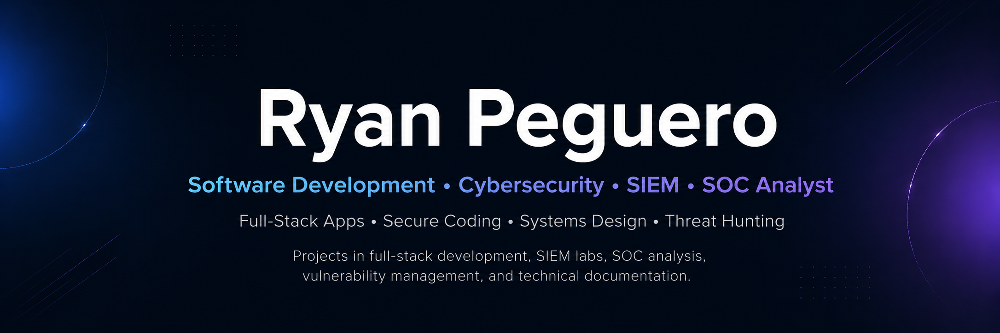

  

  <strong><em>Matthew 5:13-16</em></strong>

---

<h2 align="center">
  <strong>💻 Software Engineering &amp; Development</strong>
</h2>

## Application & Coding Projects

> Repositories containing application source code, backend logic, tests or working technical implementations.

### Full-Stack, Web & Mobile Applications

- **[Travlr Getaways Full-Stack App](https://github.com/rypeguero/cs465-full-stack-development)**  
  Full-stack travel application with a customer-facing trip catalog and an authenticated administrative interface for managing trip data.  
  **Technologies:** Node.js, Express, MongoDB, Mongoose, Angular, Handlebars

- **[Incident Ledger](https://github.com/rypeguero/Incident-Ledger)**  
  Responsive incident-tracking application for recording severity, priority, status, timestamps and resolution details.  
  **Technologies:** React, TypeScript, Supabase, PostgreSQL, Tailwind CSS

- **[Event Tracking App](https://github.com/rypeguero/EventTrackingApp)**  
  Android application for creating, updating and tracking scheduled events with persistent local storage.  
  **Technologies:** Java, Android Studio, SQLite, Android XML, Material Components

### Python, Data & Embedded Development

- **[Haunted Mansion Rescue](https://github.com/rypeguero/haunted-mansion-rescue)**  
  Command-line adventure game where players explore rooms, collect items and rescue a friend from a ghost.  
  **Technologies:** Python, dictionaries, lists, functions, loops, conditional logic

- **[CRUD Module with Python and MongoDB](https://github.com/rypeguero/CRUD-Module-With-Python-And-MongoDB)**  
  Python data-access module and dashboard for creating, reading, updating and deleting records stored in MongoDB.  
  **Technologies:** Python, MongoDB, PyMongo, Dash, Jupyter Notebook

- **[Adaptive AI Systems: Intelligent Agent Lab](https://github.com/rypeguero/Adaptive-AI-Systems-Intelligent-Agent-Lab)**  
  Reinforcement-learning project that trains an intelligent agent to navigate an environment and reach a target.  
  **Technologies:** Python, TensorFlow, Keras, Deep Q-Learning, Jupyter Notebook

- **[Embedded Systems Thermostat](https://github.com/rypeguero/Embedded-Systems-Thermostat-)**  
  Raspberry Pi thermostat prototype that reads environmental data and controls hardware through embedded interfaces.  
  **Technologies:** Python, Raspberry Pi 4B, GPIO, I²C, UART, AHT20 sensor

### Java, C++ & Software Testing

- **[CS 210 Programming Languages](https://github.com/rypeguero/CS-210-Programming-Languages)**  
  C++ coursework demonstrating modular console applications, file processing, input validation and structured program design.  
  **Technologies:** C++, standard library, file I/O, functions, input validation

- **[Contact Service](https://github.com/rypeguero/ContactService)**  
  Java service layer for creating, updating and validating contact records with automated unit tests.  
  **Technologies:** Java, object-oriented programming, JUnit, service-layer design

- **[Secure Coding](https://github.com/rypeguero/Secure-Coding)**  
  Secure Java web application demonstrating encrypted communication, dependency analysis and defensive coding practices.  
  **Technologies:** Java, Spring Boot, Maven, SSL/TLS, OWASP Dependency-Check

- **[Secure Software Portfolio C++](https://github.com/rypeguero/Secure-Software-Portfolio-CPP)**  
  C++ secure-development portfolio focused on validation, testing, static analysis and memory-safe programming practices.  
  **Technologies:** C++, unit testing, static analysis, memory safety, secure coding standards

## Software Planning, Design & Documentation

> Repositories focused on requirements, UML diagrams, Agile planning, architecture decisions, presentations and supporting documentation.

- **[CS Capstone ePortfolio](https://github.com/rypeguero/rypeguero.github.io)**  
  Professional software-engineering portfolio presenting enhanced projects, code reviews and technical reflections.  
  **Technologies & Tools:** GitHub Pages, HTML, CSS, JavaScript, software documentation

- **[System Analysis and Design: DriverPass](https://github.com/rypeguero/System-Analysis-And-Design-DriverPass)**  
  System-design case study translating business needs into requirements, user workflows, UML models and technical recommendations.  
  **Technologies & Tools:** UML, Mermaid, requirements analysis, AWS/Azure planning, Python, MySQL/PostgreSQL

- **[CS 250 Software Development Lifecycle](https://github.com/rypeguero/CS-250-Software-Development-Lifecycle)**  
  Agile case study examining Scrum roles, user stories, sprint planning, backlog refinement and team communication.  
  **Technologies & Tools:** Agile, Scrum, Jira, Confluence, user stories, sprint planning

- **[CS 230 Operating Platforms](https://github.com/rypeguero/CS-230-Operating-Platforms)**  
  Software-architecture proposal comparing operating platforms and recommending a scalable, secure deployment design.  
  **Technologies & Tools:** architecture analysis, Linux, Windows, macOS, cloud deployment, security planning

---

<h2 align="center">
  <strong>🔐 Cybersecurity &amp; Security Engineering</strong>
</h2>

## Security Engineering & Hands-On Labs

> Technical labs, security tooling, infrastructure configuration, automation and defensive-security work.

- **[SIEM Lab & Honeypot](https://github.com/rypeguero/honeypot-siem-lab)**  
  Internet-facing honeypot lab that captures malicious activity and visualizes attack telemetry for analysis.  
  **Technologies:** T-Pot, Cowrie, Suricata, Elastic Stack, Kibana, Linux

- **[Log(N) Pacific Cyber Range SOC](https://github.com/rypeguero/microsoft-soc-cyber-range)**  
  Hands-on SOC repository covering endpoint investigations, alert triage, threat hunting and incident documentation.  
  **Technologies:** Microsoft Sentinel, Microsoft Defender for Endpoint, KQL, MITRE ATT&CK, Azure

- **[Vulnerability Management Program Implementation](https://github.com/rypeguero/Vulnerability-Management-Program-Implementation)**  
  End-to-end vulnerability-management project covering discovery, prioritization, remediation and verification across cloud systems.  
  **Technologies:** Tenable.io, Nessus, Azure VMs, Windows, Linux, CVE, CVSS

- **[Vulnerability Remediations](https://github.com/rypeguero/Vulnerability-Remediations)**  
  Collection of remediation scripts and hardening procedures for correcting Windows and Linux security findings.  
  **Technologies:** PowerShell, Bash, DISA STIG, Windows, Linux

- **[GhostTrail: Linux Deception Detection Prototype](https://github.com/rypeguero/GhostTrail)**  
  Linux detection prototype that analyzes process relationships and produces visual evidence for suspicious activity.  
  **Technologies:** Python, Linux, `/proc`, Graphviz, JSON

## Security Reports, Guides & Writeups

> Deployment documentation, SOC learning writeups and supporting investigation notes.

- **[T-Pot Kibana Deployment Guide](https://github.com/rypeguero/Honeypot-SIEM-Lab-T-Pot-Kibana-Deployment)**  
  Step-by-step deployment guide for building a cloud-hosted T-Pot honeypot and reviewing telemetry in Kibana.  
  **Technologies:** T-Pot, Docker, Elastic Stack, Kibana, Linux VPS

- **[TryHackMe SOC Level 1 Writeups](https://github.com/rypeguero/tryhackme-soc-level-1-writeups)**  
  Documented SOC investigations covering phishing, endpoint telemetry, log analysis and common attacker techniques.  
  **Technologies:** Splunk, Sysmon, Windows Event Logs, Linux logs, MITRE ATT&CK

## Threat Hunts & Detection Investigations

> Structured investigations tracing suspicious behavior across endpoint, identity, network and SIEM telemetry.

- **[Hide Your RDP: Password Spray Leads to Full Compromise](https://github.com/rypeguero/logn-pacific-cyber-range/blob/main/threat-hunting/hide-your-rdp-password-spray-to-full-compromise.md)**  
  Threat hunt tracing an RDP password-spray attack through persistence, defense evasion, command-and-control and attempted exfiltration.  
  **Technologies:** Microsoft Sentinel, Microsoft Defender for Endpoint, KQL, MITRE ATT&CK

- **[Nimbus Health: Just Another Day](https://github.com/rypeguero/microsoft-soc-cyber-range/blob/main/threat-hunting/Nimbus%20Health%20Threat%20Hunt%20Report.md)**  
  Investigation of a valid-account compromise involving external access, lateral movement and collection of sensitive HR and billing data.  
  **Technologies:** Microsoft Sentinel, Microsoft Defender for Endpoint, KQL, RDP, MITRE ATT&CK

- **[Health Hazard Threat Hunt](https://github.com/rypeguero/tryhackme-soc-level-1-writeups/blob/main/siem-investigations/health-hazard.md)**  
  SIEM investigation reconstructing malicious PowerShell execution, DNS activity and registry-based persistence.  
  **Technologies:** Splunk, Sysmon, PowerShell, DNS logs, Windows Registry, MITRE ATT&CK

- **[Unauthorized Tor Threat Hunt](https://github.com/rypeguero/Threat-Hunting-Scenario-TOR)**  
  Endpoint threat hunt identifying unauthorized Tor installation and usage through process, file and network telemetry.  
  **Technologies:** Microsoft Defender for Endpoint, KQL, device telemetry, IOC analysis
